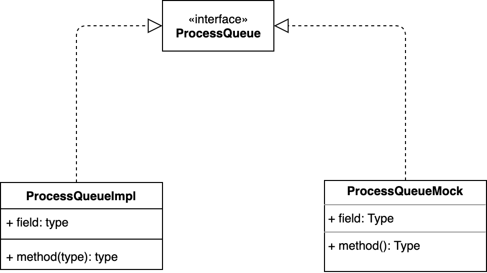
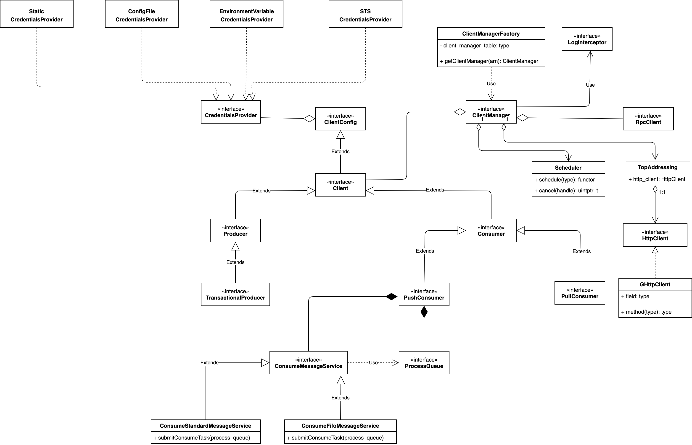

[](https://github.com/lizhanhui/rocketmq-client-cpp/actions/workflows/main.yml)
### Introduction
Apache RocketMQ supports two styles of APIs to acknowledge messages once they are successfully processed.

1. Selective Acknowledgement
   For each logical message queue(aka, topic partition), SDK manages offsets locally and periodically syncs committed offset to brokers in charge.
2. Per Message Acknowledgement
   On consumption of each message, SDK acknowledge it to the broker instantly. Broker is responsible of managing consuming progress. 

Either of them is widely adopted by products. Per message acknowledgement simplifies SDK implementation while selective approach is more performant considering that fewer RPCs are required.

### Transport Layer

This SDK is built on top of [gRPC](https://grpc.io/). [Protocol Buffers](https://developers.google.com/protocol-buffers) is used to serialize application messages.

### Type Hierarchy
Classes of this project are designed to be interface oriented.

This paradigm makes dependency injection possible. DI is especially helpful when writing unit tests.

### Core Concepts


### Code Style
Generally, we follow [Google C++ Code Style](https://google.github.io/styleguide/cppguide.html). A few exceptions are made to maintain API compatibility.
1. C++ exception is only allowed in the outer wrapper classes, for example, DefaultMQProducer, DefaultMQConsumer.
2. C++ --std=c++11 is preferred. We intend to maintain the same compiler compatibility matrix to [those of gRPC](https://github.com/grpc/grpc/blob/master/BUILDING.md)
3. Smart pointers are preferred where it makes sense. Use raw pointers only when it is really necessary.

### Dependency Management   
Considering SDK built on top of gRPC, ensure it is really necessary before introducing a third-party library. Check [gRPC deps](https://github.com/grpc/grpc/blob/master/bazel/grpc_deps.bzl) and [gRPC extra deps](https://github.com/grpc/grpc/blob/master/bazel/grpc_extra_deps.bzl) first!

When introducing a third-party dependency or raising version of a dependency, make sure it is back-off friendly. For example,
```
if "com_google_googletest" not in native.existing_rules():
   http_archive(
         name = "com_google_googletest",
         sha256 = "b4870bf121ff7795ba20d20bcdd8627b8e088f2d1dab299a031c1034eddc93d5",
         strip_prefix = "googletest-release-1.11.0",
         urls = [
            "https://github.com/google/googletest/archive/refs/tags/release-1.11.0.tar.gz",
         ],
   )
```

### How To Build
[Google Bazel](https://bazel.build/) is the primary build tool we supported, Please follow [bazel installation guide](https://docs.bazel.build/versions/main/install.html).


1. Build
   From the repository root, 
   ```
   bazel build :all
   ```
2. Run Unit Tests
   From the repository root,
   ```
   bazel test //src/test/cpp/ut/...
   ```

### IDE
[Clangd](https://clangd.llvm.org/) is a really nice code completion tool. Clangd requires compile_commands.json to work properly. 
To generate the file, we need clone another repository along with the current one.

```
git clone git@github.com:grailbio/bazel-compilation-database.git
```
From current repository root,

```
../bazel-compilation-database/generate.sh
```
Once the script completes, you should have compile_commands.json file in the repository root directory.

[Visual Studio Code](https://code.visualstudio.com/) + [Clangd](https://clangd.llvm.org/) is the recommended development toolset. LLVM project has an extension for [clangd](https://marketplace.visualstudio.com/items?itemName=llvm-vs-code-extensions.vscode-clangd). Please install it from the extension market. 

The following configuration entries should be appended to your VSC settings file.
```text
    "C_Cpp.intelliSenseEngine": "Disabled",
    "C_Cpp.autocomplete": "Disabled", // So you don't get autocomplete from both extensions.
    "C_Cpp.errorSquiggles": "Disabled", // So you don't get error squiggles from both extensions (clangd's seem to be more reliable anyway).
    "clangd.path": "/Users/lizhanhui/usr/clangd_12.0.0/bin/clangd",
    "clangd.arguments": ["-log=verbose", "-pretty", "--background-index"],
    "clangd.onConfigChanged": "restart",
```